# Target In Combat - TIC

A WoW Forever addon that shows whether a unit is in combat, on nameplates and on the target portrait. Rogues can turn on a Sap mode that tells at a glance who can be sapped, and how long their Sap has left.

Built for world PvP: an enemy out of combat can mount, drink, stealth or resurrect. An enemy in combat cannot.

## Screenshots

| | Nameplate | Target portrait |
|---|---|---|
| In combat | 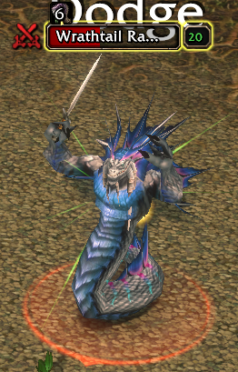 | 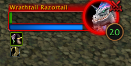 |
| Out of combat (optional Zzz) | 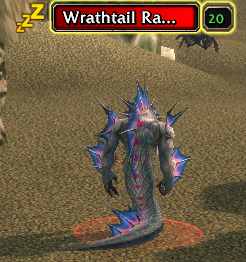 | 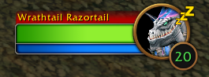 |
| Sap ready: humanoid, in range, stealthed | 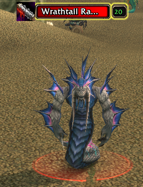 | 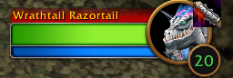 |
| Sappable, but out of range | 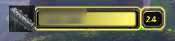 | 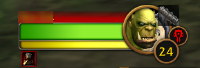 |
| Not sappable: beast | 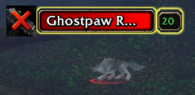 | 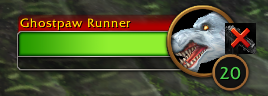 |
| Not sappable: player in cat form | 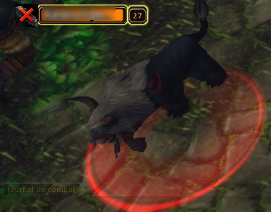 | 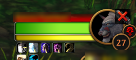 |

Sap timer, seconds left on your Sap:

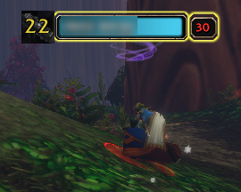

## Combat mode (every class)

| Icon | Meaning |
|---|---|
| Red crossed swords | In combat |
| Nothing | Out of combat |
| Zzz (optional) | Out of combat, when "Also show units out of combat" is on |

- On the left of each nameplate. On friendly players shown as a name only, next to the name.
- On the ring of the target portrait. A slider moves it anywhere around the portrait.
- Filters: enemy players (on by default), enemy NPCs, friendly units.

## Sap mode (rogues)

On hostile units out of combat, the combat icon becomes the Sap icon:

| Icon | Meaning |
|---|---|
| Colored | Sap lands right now: humanoid, in range, you are stealthed |
| Grey | Sappable, but out of range or you are not stealthed |
| Grey with a red X | Cannot be sapped: not humanoid, shapeshifted (druid forms, Ghost Wolf) or immune (Divine Shield, Ice Block, Blessing of Protection) |

Once you have sapped a unit, its icon shows the time left on your Sap, as a clock sweep and in seconds, whether it is grey or colored. The time comes from the real debuff, so it is exact, and it disappears as soon as Sap breaks.

Range comes from the game's own Sap range check, so any range bonus is taken into account. There is no distance countdown on purpose: the game does not give the exact distance to an enemy, and an approximate number would mislead.

## Options

`/tic` opens the panel in Options > AddOns:

- Show on nameplates, show on the target portrait
- Show when targeting yourself, to see the icon while you set it up
- Icon size, position around the target portrait
- Rounded corners, separately for the target portrait and the nameplates
- Unit filters and the out-of-combat Zzz
- Sap mode (rogues only)

## Limits

WoW Forever runs on the modern client, which hides some data from addons:

- While **you** are in combat, auras are hidden. Sap mode can then no longer check forms and immunities, and the icon goes back to plain combat yes/no. You cannot Sap in combat anyway.
- Nameplates the game protects (some friendly plates in instances) cannot be decorated.

## Development

- `luacheck addon` to lint.
- `scripts\dev.ps1` (or `dev.cmd`) copies the addon into the game. The AddOns path goes in a gitignored `scripts\dev.local.ps1` setting `$WowAddOnsPaths`.
- Publishing a GitHub Release uploads the zip to CurseForge (`.github/workflows/publish-curseforge.yml`, secret `CURSEFORGE_API_TOKEN`). A plain push does not publish.

## License

GPL-3.0
